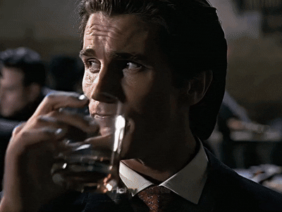

  
  <h1>Effect-Transition-Ideas</h1>
  
A web app to help editors think of effect & transition ideas to use in their edits

- 💡 Stop getting stuck when trying to think of what effects and transitions to include in your edits
- 🧠 Increase the creativity of your edits by working within a set of constraints

## About
A web application that helps editors generate ideas for effects and transition they can make for their edits by ethier inputing a set of idea constraints themselves or have the app randomly generate some ideas. Editors can take those generated idea constraints and create the effect and/or transition in their edit within their editing software, primarily in After Effects.

> “Creativity needs constraint. When the constraints get tighter, you will find more opportunities to be creative!” 
>\- [Jomny Sun](https://en.wikipedia.org/wiki/Jonny_Sun)

## Who is this for?
This is primarily indented for people who make AMV (Anime Music Video) edits in After Effects, but this can be used by people who use different video editing software and people who make edits of different genres, other than Anime. 

### Terminology for the unfamiliar
> An edit is when one composes a video filled with scenes and or pictures, using transitions and effects.  
>\- [Urban Dictionary](https://www.urbandictionary.com/define.php?term=Edit)

Edits can be found across social media platforms like YouTube, Tiktok and Instagram.
| This is what an AMV looks like. An anime edit also refers to AMV's. | Edits come from many genres like this edit American Psycho edit|
| ------------- | ------------- |
|  Video Credit: [full YouTube video](https://www.youtube.com/watch?v=xBteE-edssQ)|  Video Credit: [full YouTube video](https://www.youtube.com/watch?v=nuUGGTQfJMg&pp=ygUUcGF0cmljayBiYXRlbWFuIGVkaXQ%3D)|

## How It Works (Upcoming)
1. Go to this website: (TBA)
1. Input as many and different kinds of contraints as possible by filling out the form fields
2. Press the 'Generate' button to generate an idea for what effect and/or transition you can create within your edit
3. Within your video editing software, work to create effect and/or transition within the constraints generated from the 'Generate' button
